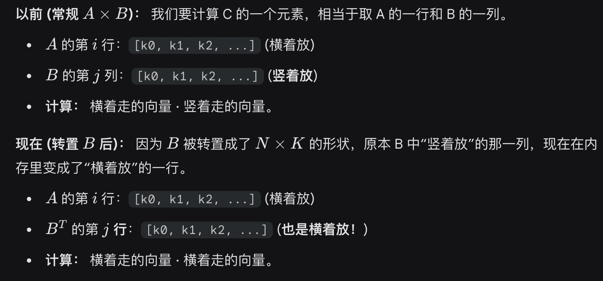
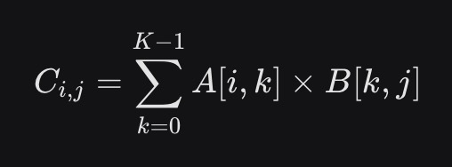
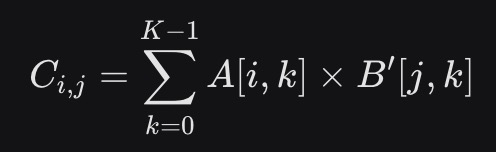

```cpp
__global__ void matMulNaive(float *A, float *B, float *C, int M, int N, int K) {
    int row = blockIdx.y * blockDim.y + threadIdx.y;
    int col = blockIdx.x * blockDim.x + threadIdx.x;

    if (row < M && col < N) {
        float sum = 0.0f;
        for (int k = 0; k < K; ++k) {
            // A 读取良好：连续
            // B 读取糟糕：stride 为 N
            sum += A[row * K + k] * B[k * N + col]; 
        }
        C[row * N + col] = sum;
    }
}
```

```cpp
// 假设传入的 B_T 已经是 B 的转置矩阵，维度为 [N, K]
__global__ void matMulTransposed(float *A, float *B_T, float *C, int M, int N, int K) {
    int row = blockIdx.y * blockDim.y + threadIdx.y;
    int col = blockIdx.x * blockDim.x + threadIdx.x;

    if (row < M && col < N) {
        float sum = 0.0f;
        for (int k = 0; k < K; ++k) {
            // A 读取良好：连续
            // B_T 读取良好：也是连续的！(col 变成了 B_T 的行索引)
            sum += A[row * K + k] * B_T[col * K + k];
        }
        C[row * N + col] = sum;
    }
}
```


总结：
以前是MxK * KxN
现在是MxK * (NxK)T，**但其实本质是MxK*NxK，是B矩阵也是按照行索引**
以前是col那一列：k * N + col
现在是col那一行：col*K + k
原始AB：

新AB'

