## flash attention 干了什么

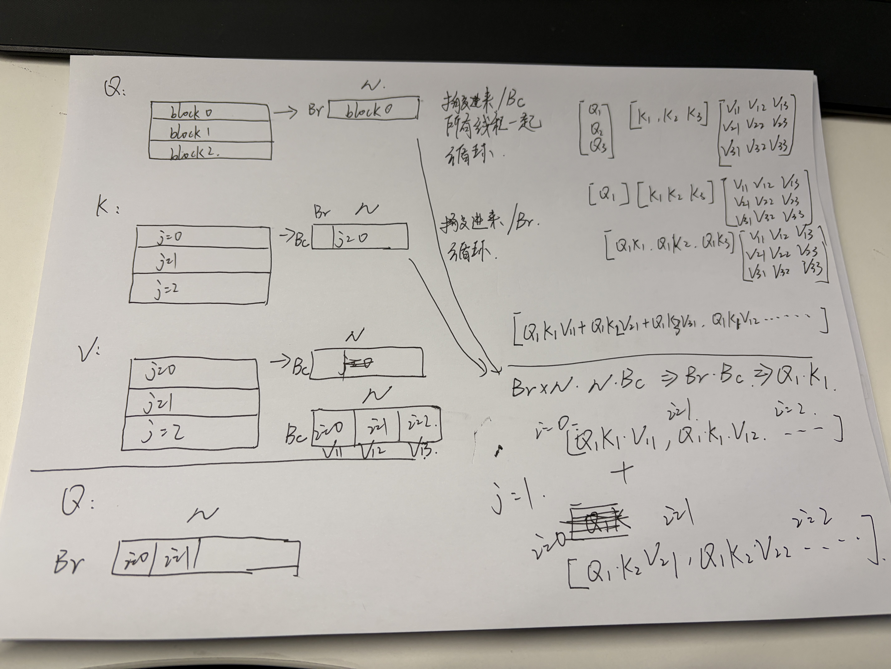

```cpp
template <typename Ty, int kBc = 4, int kBr = 4, int kDim = 128>
__global__ void flash_attention_v2_kernel(Ty* Q, Ty* K, Ty* V, Ty* O,
                                          int seqlen,       // M
                                          int stride_head,  // M*N
                                          Ty smScale) {
  int groupSeq = (seqlen + kBc - 1) / kBc;
  int groupTx = (kDim + kBc - 1) / kBc;
  int groupTy = (kDim + kBr - 1) / kBr;
  __shared__ Ty sQ[kBr][kDim];
  __shared__ Ty sK[kBc][kDim];
  __shared__ Ty sV[kBc][kDim];
  __shared__ Ty sO[kBr][kDim];
  __shared__ Ty sQK[kBr][kBc];
  __shared__ Ty sSafeE[kBr][kBc];
  __shared__ Ty sDenom[kBr];
  __shared__ Ty sMax[kBr];

  int tx = threadIdx.x;
  int ty = threadIdx.y;
  int base_offset = blockIdx.x * stride_head;
  int row = ty + blockIdx.y * blockDim.y;
  if (row >= seqlen) {
    return;
  }

  //   显存地址 (内存是线性的)
  // 0         1000        2000        3000        ...
  // |-----------|-----------|-----------|-----------| ...
  // | Batch0    | Batch0    | Batch0    | Batch1    |
  // | Head0     | Head1     | Head2     | Head0     |
  // | 数据      | 数据      | 数据      | 数据      |
  // |-----------|-----------|-----------|-----------|
  // ^           ^           ^
  // 初始指针Q    偏移后的Q    再偏移...

  Q += base_offset;  // 见上图 所以需要偏移
  K += base_offset;
  V += base_offset;
  O += base_offset;

  // 每个block都搬移一整行块进来
  for (int i = 0; i < groupTx; i++) {
    sQ[ty][i * kBc + tx] = Q[row * kDim + i * kBc + tx];  // Q0
    sO[ty][i * kBc + tx] = 0;
  }

  sMax[ty] = -INFINITY;  // 行最大值 实时修正
  sDenom[ty] = 0;        // 每一行的分母 实时修正

  // Outer loop over KV blocks
  // 即M方向最大值 所以在一个block中循环即可
  for (int j = 0; j < groupSeq; j++) {  // KV的M方向循环（要反过来
    // Load K and V
    if ((j * kBc + tx) < seqlen) {
      // 这个搬运与上面P矩阵搬运类似
      for (int i = 0; i < groupTy; i++) {  // KV的N方向循环
        // j = 0:K0, j = 1: K1 ...
        sK[tx][i * kBr + ty] = K[j * kBc * kDim + tx * kDim + i * kBr + ty];
        // j = 0:V0, j = 1: V1 ...
        sV[tx][i * kBr + ty] = V[j * kBc * kDim + tx * kDim + i * kBr + ty];
      }
    }

    __syncthreads();

    // Compute Q * K^T
    Ty sum = 0.f;
    for (int i = 0; i < kDim; i++) {
      sum += sQ[ty][i] * sK[tx][i];
    }

    // 每一个thread都算一下
    // 最终汇聚起来就是Q0*K0^T
    sQK[ty][tx] = sum * smScale;

    __syncthreads();

    // Find max for numerical stability
    // 寻找QK的行最大值进行softmax
    // 每个thread，每个小块都自己找对应该行的最大值
    Ty localMax = -INFINITY;
    for (int i = 0; i < kBc; i++) {
      localMax = max(localMax, sQK[ty][i]);
    }
    __syncthreads();
    // 历史最大值 Q0K0 Q0K1 Q0K2中
    Ty newMax = max(sMax[ty], localMax);

    // Compute Exponentials
    // 计算当前小方块的分子
    sSafeE[ty][tx] = exp(sQK[ty][tx] - newMax);
    __syncthreads();

    // Compute Denominator
    Ty localDenom = 0.f;
    for (int i = 0; i < kBc; i++) {
      // 计算当前小方块的分母(求和)
      localDenom += sSafeE[ty][i];
    }
    __syncthreads();

    // Update Output (Online Softmax)
    // 分母修正用 乘在分母前
    Ty rescaleOld = exp(sMax[ty] - newMax);
    // 分母：旧数据贡献*修正 + 新数据贡献
    Ty newDenom = sDenom[ty] * rescaleOld + localDenom;
    // i控制v的列循环 也控制O的列循环
    for (int i = 0; i < groupTx; i++) {
      // 修正老的分子
      sO[ty][i * kBc + tx] = (sO[ty][i * kBc + tx] * rescaleOld);
      // 小方块内矩阵计算
      for (int k = 0; k < kBc; k++) {
        sO[ty][i * kBc + tx] += sSafeE[ty][k] * sV[k][i * kBc + tx];
      }
    }
    // 更新QK矩阵的行最大值
    sMax[ty] = newMax;
    // 更新老分母
    sDenom[ty] = newDenom;
    __syncthreads();
  }

  // Write output to global memory
  for (int i = 0; i < groupTx; i++) {
    // 全局更新分母
    O[row * kDim + i * kBc + tx] = sO[ty][i * kBc + tx] / sDenom[ty];
  }
}

torch::Tensor flash_attention_v2_cuda(torch::Tensor q, torch::Tensor k,
                                      torch::Tensor v) {
  CHECK_INPUT(q);
  CHECK_INPUT(k);
  CHECK_INPUT(v);

  // 1, 1, M, N
  int bs = q.size(0);
  int head = q.size(1);
  int seqlen = q.size(2);  // M
  int dim = q.size(3);     // N
  float sm_scale = 1.f / sqrtf(static_cast<float>(dim));
  int stride_head = seqlen * dim;

  auto out = torch::zeros_like(q);

  const int Br = 4;
  const int Bc = 4;
  int Gc = bs * head;
  int Gr = (seqlen + Br - 1) / Br;

  assert(dim % Bc == 0 && seqlen % Br == 0);

  dim3 grid = dim3(Gc, Gr);
  dim3 block = dim3(Bc, Br);

  using scalar_t = float;
  flash_attention_v2_kernel<scalar_t, Bc, Br, 128><<<grid, block>>>(
      q.data_ptr<scalar_t>(), k.data_ptr<scalar_t>(), v.data_ptr<scalar_t>(),
      out.data_ptr<scalar_t>(), seqlen, stride_head, sm_scale);

  return out;
}
```

### 简单的线代基础

$$C_{[m \times n]} = A_{[m \times p]} \times B_{[p \times n]}$$

如果 A 矩阵再拆分为 2 个
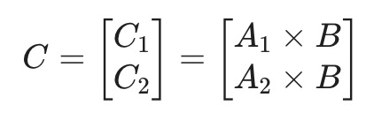
如果 B 矩阵再拆分为 2 个
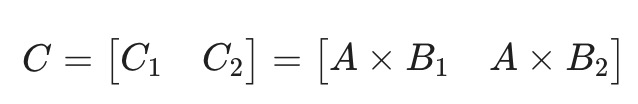
如果 AB 都拆
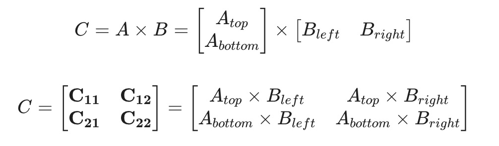

### 原始 self-attention 步骤

总结：简单的矩阵分块，一行一起 softmax
三次写入三次写出：1. QKt 写入写出，2. softmax 写入写出，3. PV 乘法写入写出

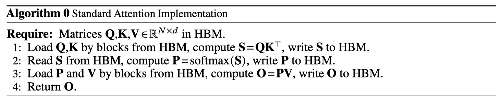
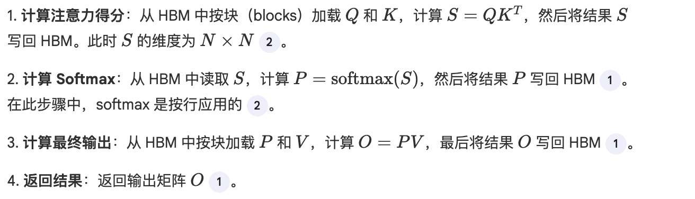

### flash 版本

总结：矩阵分块计算，softmax 也基本是分块计算
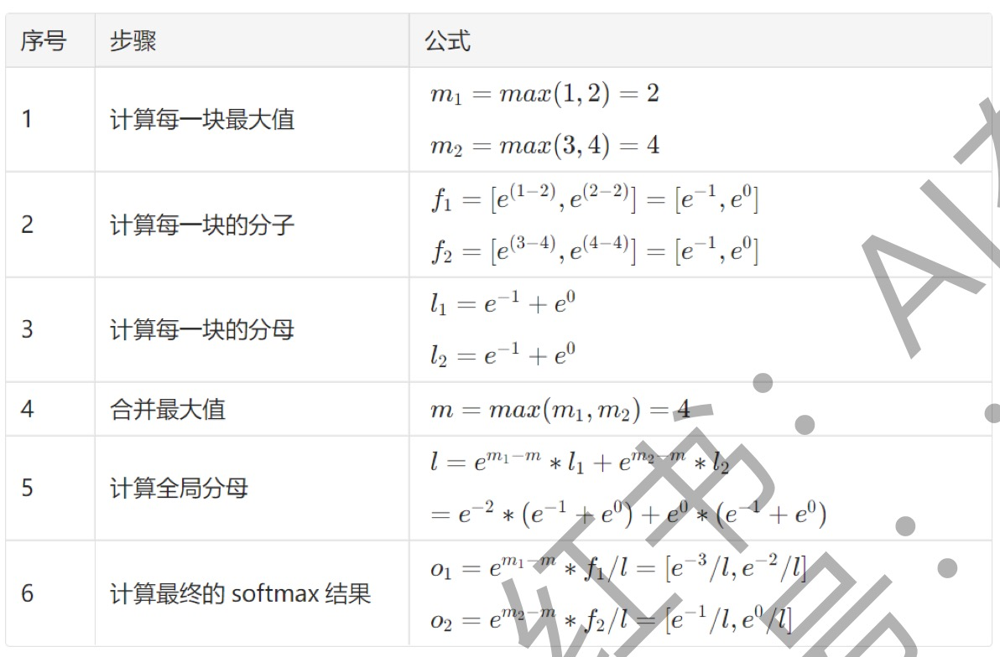
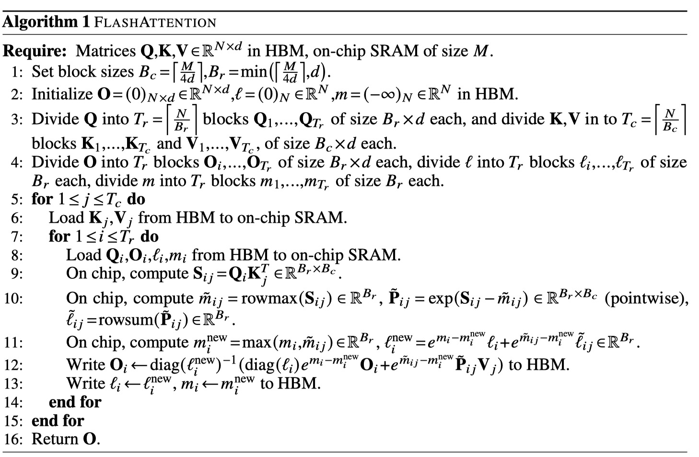
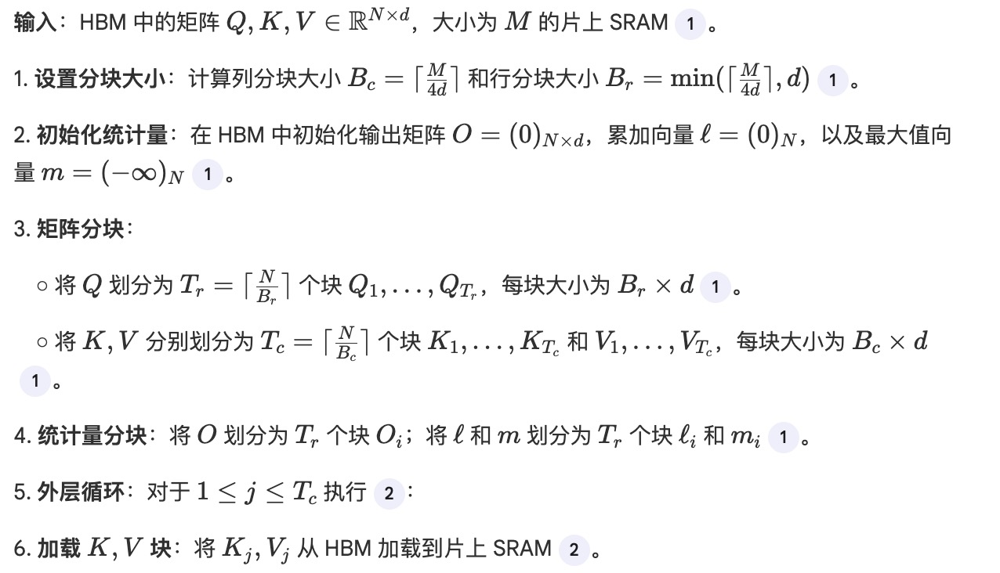
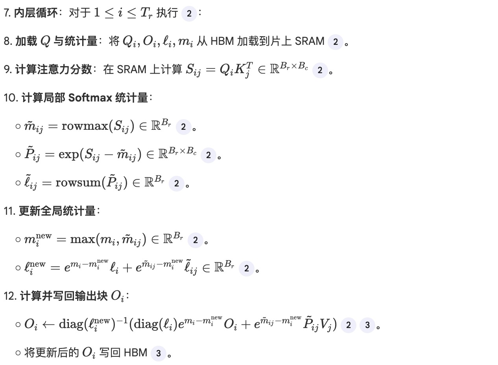
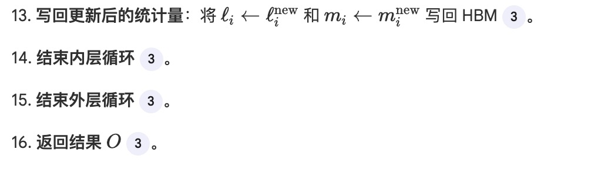

## self-attention

### 1. 输入定义

输入矩阵为 $M \times N$：

- **序列长度**：$M$
- **嵌入维度**：$N$

### 2. Attention 公式

$$
\text{Attention}(Q, K, V) = \text{softmax}\left(\frac{QK^T}{\sqrt{d_k}}\right)V
$$

线性变换：
$$Q = XW_Q, \quad K = XW_K, \quad V = XW_V$$

### 3. 参数说明

$$
d_k = \frac{N}{h}
$$

- **$N$**: 输入矩阵的列数（即 $d_{model}$）
- **$h$**: 模型设计时的超参数“头数”（num_heads）

### 4. Softmax 计算 (数值稳定性优化)

$$
\text{softmax}(z_i) = \frac{e^{z_i - \max(\mathbf{z})}}{\sum_{j=1}^n e^{z_j - \max(\mathbf{z})}}
$$

- **$\mathbf{z}$**: 表示每一行（输入向量）
- **分母**: 表示对该行所有元素求和
- **分子**: 表示当前元素经过数值稳定处理后的指数值
