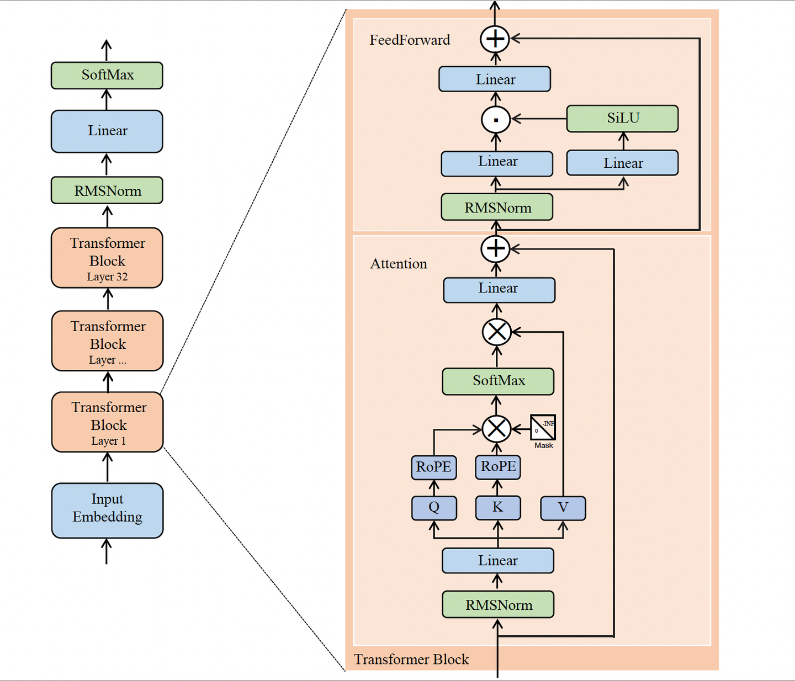

# LLaMa

- LLaMA 1: 7B / 13B / 33B / 65B
- Llama 2: 7B / 13B / 70B
- Llama 3: 8B / 70B
- Llama 3.1: 8B / 70B / 405B
- Llama 3.2: 1B / 3B（文本）, 11B / 90B（视觉）
- Code Llama: 7B / 13B / 34B / 70B

## 核心配方一直不变

- decoder-only Transformer
- RMSNorm
- SwiGLU
- RoPE

## 小变化

- llama1->Llama 2：context length 提高 + 引入 GQA
- tokenizer 明显变大（32K → 128K）+
- GQA 从部分/重点使用走向全系使用 +
- context length 继续提升（Llama 3 到 8K）+
- 训练数据规模和数据质量大幅增强

### 推理主体伪代码

```python
import math


def rmsnorm(x, weight, eps=1e-6):
    # x: [batch_size, seq_len, hidden_size]
    # weight: [hidden_size]
    rms = (x.pow(2).mean(dim=-1, keepdim=True) + eps).rsqrt()  # [batch_size, seq_len, 1]
    return x * rms * weight  # [batch_size, seq_len, hidden_size]


def llama_forward(
    x_ids,              # [batch_size, seq_len]
    embed_tokens,       # [vocab_size, hidden_size]
    layers,             # L 个 Transformer block
    final_norm_weight,  # [hidden_size]
    w_vocab,            # [hidden_size, vocab_size]
    pos_ids,            # [batch_size, seq_len]
    causal_mask,        # [1, 1, seq_len, seq_len] or broadcastable
):
    # 1) token id -> embedding
    x = embed_tokens[x_ids]  # [batch_size, seq_len, hidden_size]

    # 2) 依次通过每一层 Transformer block
    for layer in layers:
        batch_size, seq_len, hidden_size = x.shape
        num_q_heads = layer.H_q
        num_kv_heads = layer.H_kv
        head_dim = layer.d_h

        # Attention 前的 RMSNorm
        x_norm = rmsnorm(x, layer.attn_norm_weight)  # [batch_size, seq_len, hidden_size]

        # Q, K, V 线性投影
        q = x_norm @ layer.wq  # [batch_size, seq_len, num_q_heads * head_dim]
        k = x_norm @ layer.wk  # [batch_size, seq_len, num_kv_heads * head_dim]
        v = x_norm @ layer.wv  # [batch_size, seq_len, num_kv_heads * head_dim]

        # 拆成多头
        q = q.view(batch_size, seq_len, num_q_heads, head_dim).transpose(1, 2)    # [batch_size, num_q_heads, seq_len, head_dim]
        k = k.view(batch_size, seq_len, num_kv_heads, head_dim).transpose(1, 2)   # [batch_size, num_kv_heads, seq_len, head_dim]
        v = v.view(batch_size, seq_len, num_kv_heads, head_dim).transpose(1, 2)   # [batch_size, num_kv_heads, seq_len, head_dim]

        # RoPE 位置编码
        q = apply_rope(q, pos_ids)  # [batch_size, num_q_heads, seq_len, head_dim]
        k = apply_rope(k, pos_ids)  # [batch_size, num_kv_heads, seq_len, head_dim]

        # 如果是 GQA，把 K / V 扩展到和 Query 头数对齐
        if num_q_heads != num_kv_heads:
            group_size = num_q_heads // num_kv_heads
            k = k.repeat_interleave(group_size, dim=1)  # [batch_size, num_q_heads, seq_len, head_dim]
            v = v.repeat_interleave(group_size, dim=1)  # [batch_size, num_q_heads, seq_len, head_dim]

        # Self-Attention
        scores = (q @ k.transpose(-1, -2)) / math.sqrt(head_dim)  # [batch_size, num_q_heads, seq_len, seq_len]
        scores = scores + causal_mask                             # [batch_size, num_q_heads, seq_len, seq_len]
        probs = scores.softmax(dim=-1)                            # [batch_size, num_q_heads, seq_len, seq_len]
        attn_out = probs @ v                                      # [batch_size, num_q_heads, seq_len, head_dim]

        # 多头拼回去 + 输出投影
        attn_out = attn_out.transpose(1, 2).reshape(batch_size, seq_len, hidden_size)  # [batch_size, seq_len, hidden_size]
        attn_out = attn_out @ layer.wo                                                   # [batch_size, seq_len, hidden_size]

        # 第一次残差
        h = x + attn_out  # [batch_size, seq_len, hidden_size]

        # FFN 前的 RMSNorm
        h_norm = rmsnorm(h, layer.ffn_norm_weight)  # [batch_size, seq_len, hidden_size]

        # SwiGLU FFN
        gate = silu(h_norm @ layer.w_gate)   # [batch_size, seq_len, ffn_dim]
        up = h_norm @ layer.w_up             # [batch_size, seq_len, ffn_dim]
        ffn_out = (gate * up) @ layer.w_down # [batch_size, seq_len, hidden_size]

        # 第二次残差
        x = h + ffn_out  # [batch_size, seq_len, hidden_size]

    # 3) 最后一层 RMSNorm
    x = rmsnorm(x, final_norm_weight)  # [batch_size, seq_len, hidden_size]

    # 4) 映射回词表
    logits = x @ w_vocab  # [batch_size, seq_len, vocab_size]

    # 5) 转成概率
    probs = logits.softmax(dim=-1)  # [batch_size, seq_len, vocab_size]
    return logits, probs
```
